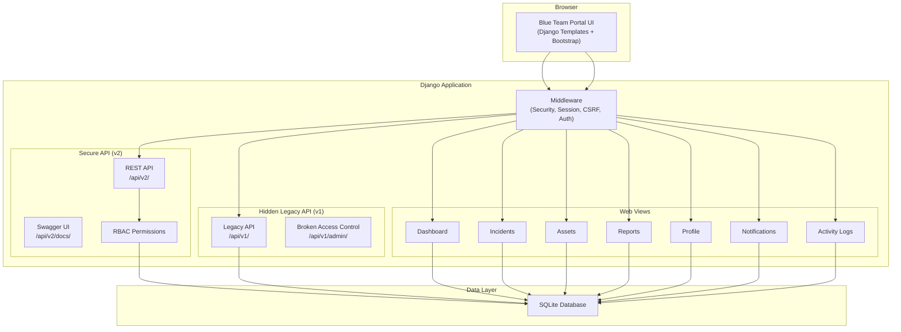
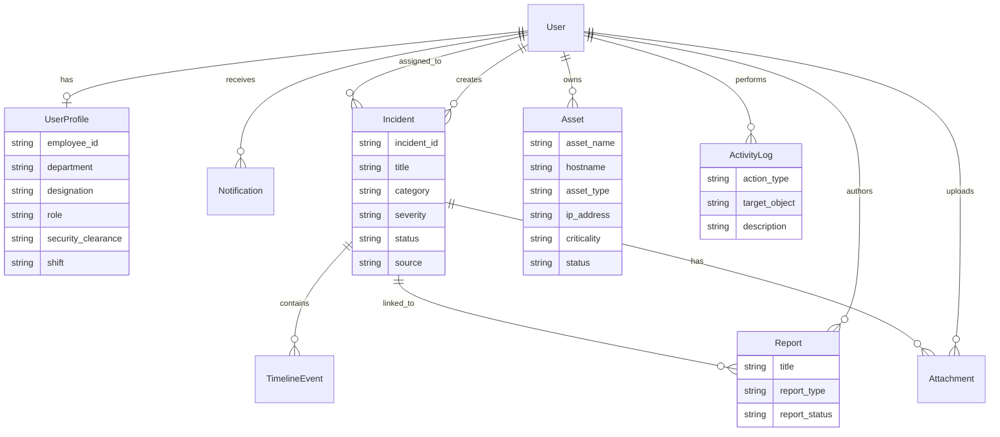
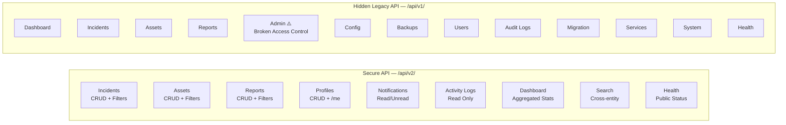
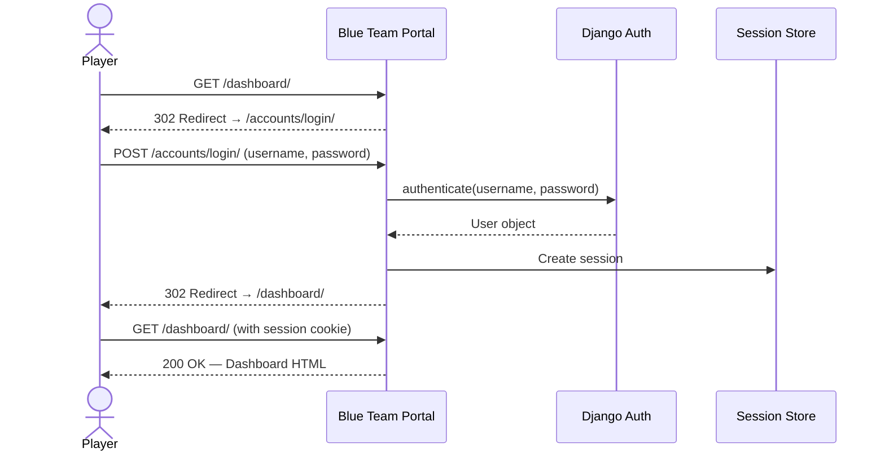
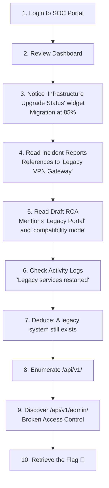
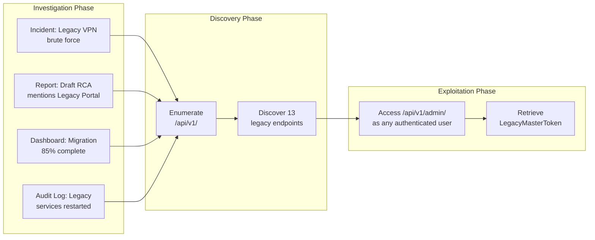

# Architecture & Design Documentation

## System Architecture

## Database Entity Relationship Diagram

## REST API Architecture

## Authentication Flow

## Investigation Workflow

## CTF Attack Path

